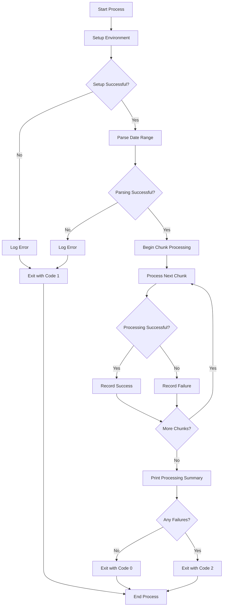

# Mambu API Backfill (Pyshell function)
This function simply runs `api-client-lambda-to-s3-raw` lambda_handler for an extended time!

## Core Functionality
- **Chunked API Processing**: Divides the requested time period into 24-hour segments to control memory usage
- **Sequence Processing**: Parallel workers are disabled not to overwhelm the Mambu API.
- **Resilience**: The process continues even if individual chunks fail.
- **Improved Exit Codes**: Separate tracking of successful and failed chunks with detailed error information
- **Summary Reporting**: Clear visual summary of processing results

## Event Structure
```python
event = {
    "table_name": "target_athena_table_name",  # Required
    "endpoint": "mambu:api_endpoint",  # Required
    "request_type": "Post",  # Required
    "cdc_field": "lastModifiedDate",  # Required for POST requests
    "start_date": "0000-00-00 00:00:00",  # Required, format: %Y-%m-%d %H:%M:%S
    "end_date": "0000-00-00 00:00:00",  # Required, format: %Y-%m-%d %H:%M:%S
    "extra_params": "",  # Optional
    "auto_schema": "False",  # Optional, True only if table is not in data_catalog.py
    "rename_columns": [],  # Optional, list of dicts [{"old_name": "new_name"}]
    "chunk_hours": 24,  # Optional, Int, default is 24 hours per lambda_handler call
}
```

## Process Flow Diagram


## Extra References
https://docs.aws.amazon.com/glue/latest/dg/setup-vpc-for-glue-access.html
https://registry.terraform.io/providers/hashicorp/aws/latest/docs/resources/glue_connection

## Exit Codes
| Code | Status | Description |
|------|--------|-------------|
| 0 | Complete Success | All chunks processed successfully |
| 1 | Complete Failure | Fatal error occurred or environment setup failed |
| 2 | Partial Success | Some chunks processed successfully, others failed |


## Sample Output
```
2025-04-07 10:15:00 - INFO - Starting Mambu API data extraction process
2025-04-07 10:15:01 - INFO - Full date range to process: 2025-01-01 00:00:00+00:00 to 2025-01-10 00:00:00+00:00
2025-04-07 10:15:01 - INFO - Total duration: 216.00 hours to be processed in 24-hour chunks
...
2025-04-07 10:45:30 - INFO - ============================================================
2025-04-07 10:45:30 - INFO - PROCESSING SUMMARY: Completed 9 chunks
2025-04-07 10:45:30 - INFO - ============================================================
2025-04-07 10:45:30 - INFO - SUCCESSFUL CHUNKS: 8/9
2025-04-07 10:45:30 - INFO - ✓ Chunk 1: 2025-01-01 00:00:00 to 2025-01-02 00:00:00
...
2025-04-07 10:45:30 - INFO - FAILED CHUNKS: 1/9
2025-04-07 10:45:30 - INFO - ✗ Chunk 5: 2025-01-05 00:00:00 to 2025-01-06 00:00:00
2025-04-07 10:45:30 - INFO - Error: Connection timeout
2025-04-07 10:45:30 - INFO - ============================================================
```
